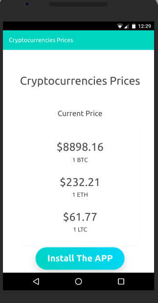

This is simple PWA project.

## Simple PWA

For launching this project, you should run:

### `npm install`

### `npm run build`

### `serve -s build`

then you will have the project served on your localhost.

###### App Functionality: it shows the price of some Cryptocurrencies...

